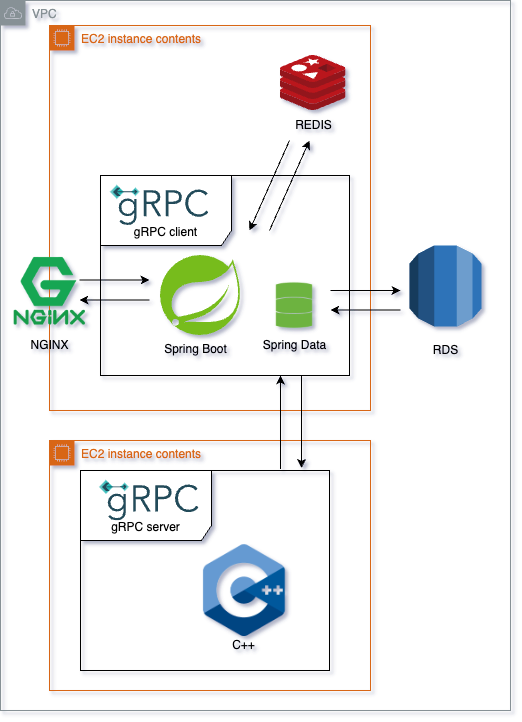

# Kicluster-BE

## 서버 아키텍처



- 주기적으로 모든 킥보드를 조회해 군집 알고리즘을 수행
    
    → 비교적 접근 속도가 빠른 REDIS를 메인 DB로 사용
    
    → CRON 식을 사용해 매일 00시 06시 12시 18시에 REDIS에서 RDB로 데이터 저장 (백업용)
    
- 알고리즘은 속도가 더 빠른 C++를 사용해 구현
    
    → GRPC를 사용해 Spring(JAVA) ↔ C++ 소통
    
    → 현재는 HTTP/2를 사용해 JSON 형태의 반환값을 String으로 전송 
    
    ```json
    DBSCAN 반환 형식
    {
    	"cluster_list" : 
    	[
    		{
    			"cluster_id" : int, //클러스터 번호
    			"kickboard_list" : //해당 클러스터에 속하는 킥보드 id 
    			[
    				long,
    			]
    		}
    	],
    	"max_cluster" : int //마지막 클러스터 번호
    }
    
    ```
    
    ```json
    ConvexHull 반환 형식
    {
        "cluster_list": [
          {
            "cluster_id": int, //클러스터 번호
            "kickboard_list": [ //해당 클러스터의 볼록껍질을 이루는 킥보드 id 및 위경도 정보
              {
                "id": long,
                "lat": double,
                "lng": double
              }
            ],
            "cent_lat": double, //해당 클러스터 볼록껍질들의 중앙 위도
            "cent_lng": double //해당 클러스터 볼록껍질들의 중앙 경도
          }
       ]  
    }
    ```
    

## API 명세

### 1. 모든 킥보드 조회 API

| Method | GET |
| --- | --- |
| End Point | /kickboards/all |

```json
{
    "kickboard_list": [
      {
        "kickboardId": Long,
        "lat": Double,
        "lng": Double,
        "clusterId": Integer,
        "parkingZone": Integer,
        "acting": Boolean
      }
    ]
  }
```

### 2. 특정 클러스터에 속한 모든 킥보드 조회 API

| Method | GET |
| --- | --- |
| End Point | /kickboards/{clusterId} |

```json
{
    "clusterId": Integer,
    "kickboardInfoList": [
      {
        "kickboardId": Long,
        "lat": Double,
        "lng": Double
      }
    ]
  }
```

### 3. 기존 (주차/금지/도로)구역에 대한 정보 조회 API

| Method | GET |
| --- | --- |
| End Point | /fixed-area/(prohibit / exist) |
- prohibit : 금지구역
- exist : 기존 주차 구역

```json
{
    "areaType": "String",
    "areaInfoList": [
      {
        "name": "String",
        "path": [
          {
            "lat": Double,
            "lng": Double
          }
        ]
      }
    ]
  }
```

### 4. DBScan, ConvexHull 알고리즘 수행 API

| Method | GET |
| --- | --- |
| End Point | /clusters/refresh |
- API를 호출하면 REDIS에 저장된 모든 킥보드 정보를 알고리즘 서버에 전송하여 DBScan → ConvexHull 알고리즘을 순차적으로 실행 후 ConvexHull 알고리즘의 수행 결과를 반환
- ConvexHull 결과로 나온 볼록껍질들의 정보를 바탕으로 다각형(Polygon)의 중앙점(Central Point)를 구하는 알고리즘을 수행하여 결과에 포함

```json
{
    "cluster_list": [
      {
        "cluster_id": Integer,
        "kickboard_list": [
          {
            "id": Long,
            "lat": Double,
            "lng": Double
          }
        ],
        "cent_lat": Double,
        "cent_lng": Double
      }
    ]
  }
```

### 5. 가장 가까운 기존 주차 구역 조회 API

| Method | GET |
| --- | --- |
| End Point | /fixed-area/nearest ? lat = “String” & lng = “String” |
- 특정 위경도에서 가장 가까운 기존 주차구역을 조회
- Query Parameter로 위도(”lat”), 경도(”lng”) 값 입력

```json
{
    "name": "String", //기존 구역을 설명하는 지정된 이름
    "path": [
      {
        "lat": Double,
        "lng": Double
      }
    ]
  }
```

### 6. 가장 가까운 클러스터 조회 API

| Method | GET |
| --- | --- |
| End Point | / clusters/nearest?lat = “String”&lng = “String” |
- 특정 위경도에서 가장 가까운 클러스터를 조회
- Query Parameter로 위도(”lat”), 경도(”lng”) 값 입력

```json
{
    "clusterId": Integer,
    "kickboard_list": [
      {
        "id": Long,
        "lat": Double,
        "lng": Double
      }
    ],
    "cent_lat": Double,
    "cent_lng": Double
  }
```